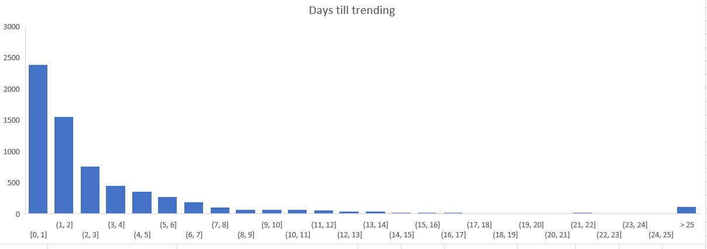
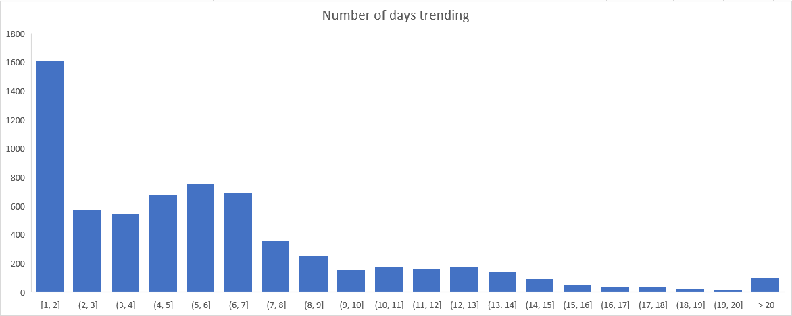
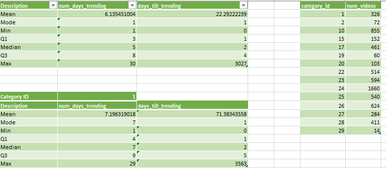

# SIF_Youtube_Data

## Introduction
The most interesting part of this dataset in my opinon was the *publish_time* and the *trending_date*. 
With this information, I wanted to find...
1.  How many days it took  for videos to become trending since the publish date (I'll call this *days_till_trending*)
2.  How long videos were trending for. (I'll call this *num_days_trending*)

## Data Preprocessing
The csv had several columns that I didn't need so I deleted those (e.g. Likes, Comments, comments_disabled, etc). Additionally, the data was organized such that there were multiple rows  of data for a single *video_id*, each row representing the day the video was trending. Having the data for each trending day was unnecessary, so I created a python script to remove extraneous rows and add new data such as *num_days_trending* and *days_till_trending*.

This left us with 6675 unique trending videos

## The discovery
I took the processed data to Microsoft Excel and found that these two datasets are heavily skewed to the right.

The **median** number of days until a video starts to trend is  2 days.

The **median** number of days a video trednds for is 5 days. 

I think the funniest part about this data is that it shows videos that have trended after 5 years after the upload date and the videos are pretty intriguing.  I'll list some here

### 1992 Chevy Lumina Euro commercial
Trended 1770 days after upload

https://www.youtube.com/watch?v=0f7CuSU_huU

### washing dishes by hand is better than using a dishwasher 
Trended 2816 days after upload

https://www.youtube.com/watch?v=K9kVsnTQh-g

## Github

If you're interested, I have the github repository where I have the pre-processing script and the microsoft excel sheet. On the excel sheet you can check out other useful stats.

https://github.com/junghochoi/SIF_Youtube_Data
